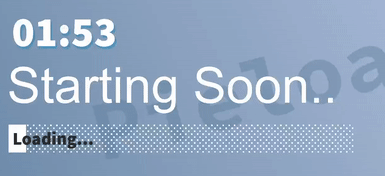

# Twitch Things

## 1. Gif Overlay

[Gif Overlay Demo](http://www.youtube.com/watch?v=EJ7VcSZDZTY)

### Set Up:

Open index.js with a text editor and in the last line of the file enter your channel name in place of `"YOUR-CHANNEL-NAME"`. Now open index.html in your browser and copy the link in the address bar. Open OBS and add a new browser source and give it the link to index.html that you just copied. I find setting width to 1000 and heigth to 800 works best. You should be all good to go. If you want to add more gifs or use redeemable channel points it's a little more complicated, but message me on discord and I can show you (or I might add it in a seperate folder on here at some point with the neccessary files).

If you have any issues let me know.

My Discord: `Pieloaf#1999`

## 2. Stream Count Down and Loading Bar

I have this one also in my scripts repository but I think it fits better here. It's a python script that counts down to the start of the stream. There's also an optional loading bar and text items with the dots increment to 3 and resetting. Each of these are written to a text file and updated once a second that OBS can then read from and display on screen:

To start just run StartStream.py and follow the instructions
