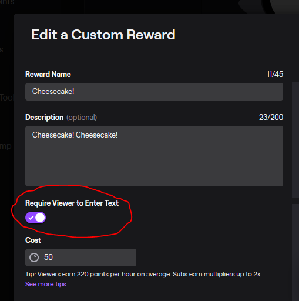
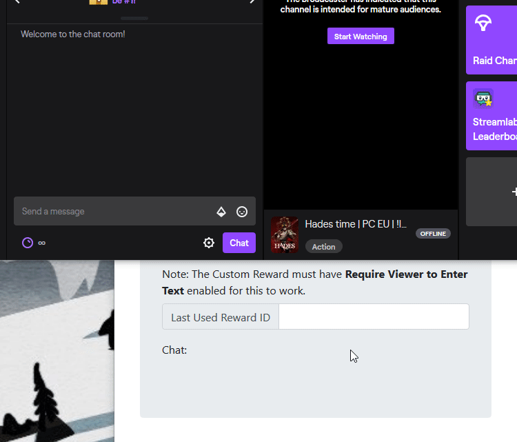

# Twitch Things

## 1. Gif Overlay

### Set Up:

Open index.js with a text editor and in the last line of the file enter your channel name in place of `"YOUR-CHANNEL-NAME"`. New open index.html in your browser and copy the link in the address bar. Open OBS and add a new browser source and give it the link to index.html that you just copied

### Adding Gifs and Sounds

First go to the assests folder. In here, add your gifs and audio files and rename them to be the same as the command eg `!cheesecake -> cheesecake.gif and cheesecake.mp3`(make sure the audio is an mp3).

Now the slightly complicated part: First of all, on twitch create a new Points Reward (make sure to require text from the user).

Next go to this site -> https://www.instafluff.tv/TwitchCustomRewardID/?channel= and put your channel name at the end of the url, eg `https://www.instafluff.tv/TwitchCustomRewardID/?channel=Pieloaf`.
Once you're on the page, redeem the new points reward in your chat and you should now see the reward ID in the box. Copy this ID and save it for later.

Now take the string provided `,{"command name here": {"text": "Text under gif goes here","Id": "Reward ID goes here"}` and insert your own details eg `,{"cheesecake": {"text": "Cheesecake!","Id": "c367cf3d-0f97-4c08-a608-e380e660dc81"}`. Finally, in gifs.js paste the string at the end of the file just inside the last `}]` in the file and save it

Now you can use !reload in chat to reload the overlay. From here you're all good to go.

If you have any issues let me know.

## 2. Stream Count Down and Loading Bar

I have this one also in my scripts repository but I think it fits better here. It's a python script that counts down to the start of the stream. There's also an optional loading bar and text items with the dots increment to 3 and resetting. Each of these are written to a text file and updated once a second that OBS can then read from and display on screen:

To start just run StartStream.py and follow the instructions
